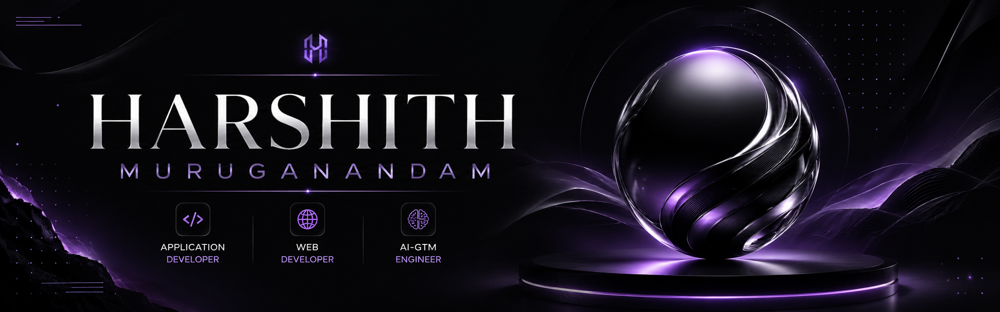

  

  

<h1 align="center">HARSHITH MURUGANANDAM</h1>

<h3 align="center">
Application Developer • Interactive Web Developer • AI-GTM Engineer
</h3>

Building Mobile Applications, AI-Powered Products & Modern Digital Experiences

---

## 🚀 About Me

- 🎓 B.Sc Computer Technology (2023 – 2026)
- 📱 Building cross-platform applications using Flutter
- 🌐 Creating modern and animated web experiences
- 🤖 Developing AI-powered solutions and automation workflows
- ☁️ Exploring Cloud, Backend Systems & Deployment
- 📍 Coimbatore, Tamil Nadu, India

---

## 🚀 Current Focus

- Flutter Application Development
- AI-Powered Products
- Interactive & Animated Web Experiences
- AI-GTM Systems
- Backend Integration & Cloud Deployment

---

## 💻 Tech Stack

### Languages

### Mobile Development

### Frontend

### Backend

### Database

### Cloud & Deployment

### Tools

### AI & GTM

## 📂 Featured Projects

### 🧠 HeartGuard AI
AI-powered heart disease prediction and risk assessment platform built using Flask, SQLite and Machine Learning.

### ⛽ SuperGas E-Com
End-to-end LPG delivery and management platform supporting multiple user roles and workflows.

### 🌱 AI Crop Disease Diagnosis
Agricultural disease identification system providing treatment recommendations using AI.

### 🎯 CrackHire AI
Interview preparation ecosystem featuring aptitude tests, coding assessments, mock interviews and performance tracking.

### 💄 DermIQ
AI-powered skincare and haircare application leveraging Gemini AI for personalized recommendations.

---

## 📊 GitHub Analytics

  
  

---

## 🔥 Contribution Streak

  

---

## 🌐 Connect With Me

<a href="https://github.com/iykyk-harshhh">GitHub</a> •
<a href="https://www.linkedin.com/in/harshith-muruganandam-b580a040a">LinkedIn</a> •
<a href="mailto:harshithmuruganandham@gmail.com">Email</a>

---

## 🐍 Contribution Graph

  

---

  <b>Building Apps • AI Products • Modern Web Experiences</b>

